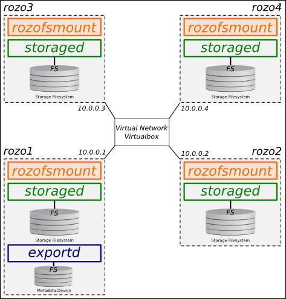

# TP - Stockage distribué

**Vendredi 9 décembre 2016 - Polytech'Nantes**

**Intervenants** :

- Sylvain DAVID - *Ingénieur R&D*  - <firstname.lastname@rozosystems.com>
- Dimitri PERTIN - *Post-Doctorant* - <firstname.lastname@inria.fr>

## Introduction

### But du TP

Le but de ce TP est de mettre en oeuvre et de comprendre l'architecture d'un système de stockage distribué avec la solution RozoFS. Pour ceux qui ont déjà manipulé RozoFS, il vous est possible d'utiliser un autre système de stockage distribué si vous le souhaiter (**nous le signaler avant si c'est le cas**).	

Dans un premier temps, vous aller mettre en oeuvre RozoFS que sur une machine (en local) pour comprendre le rôle de chaque composant RozoFS.

Dans un second temps, vous allez installer 4 machines virtuelles via l'utilitaire [Vagrant](https://www.vagrantup.com) et tester/explorer les fonctionnalités de RozoFS sur ces 4 machines.

Pour rappel, [RozoFS](https://github.com/rozofs/rozofs) est :

- un système de fichier
- distribué 
- tolérant à la panne
- scalable (horizontalement et verticalement)
- ...

## Comprendre l'architecture de RozoFS

**Avant de passer à l'installation**, répondez succinctement aux questions suivantes en vous aidant de la [documentation en ligne](http://rozofs.github.io/rozofs/develop/AboutRozoFS.html) et du contenu du cours brillamant dispensé par  Dimitri Pertin:

- Comment les données sont elles stockées sous RozoFS ? (méthode d'accès, répartition) 
- Comment et où sont stockées les méta-données des fichiers ? précisez les différents types de métadonnées existants ?
- Quels sont les avantages et les inconvénients d'une solution distribuée (comme RozoFS au autre) ?

## Installation de RozoFS sur une une seule machine (en local)

Installer les différents packages en suivant la procédure suivante :

Installation du dépôt et de la clé de signature :
```
wget -O - http://dl.rozofs.org/deb/devel@rozofs.com.gpg.key | apt-key add -
echo deb http://dl.rozofs.org/deb/develop $(lsb_release -sc) main | tee /etc/apt/sources.list.d/rozofs.list
```

Installation des paquets :
```
apt-get update
apt-get install rozofs-storaged
apt-get install rozofs-exportd
apt-get install rozofs-rozofsmount
apt-get install rozofs-manager-lib
apt-get install rozofs-manager-cli
apt-get install rozofs-manager-agent
```

Configurer les différents composants de RozoFS à l'aide de la CLI `rozo` en vous aidant de la page man (`man rozo`).

Les étapes à suivre sont les suivantes :

- Vérifier que le démon *rozofs-manager-agent* est bien démarré.
- Ajout d'un volume (`rozo volume expand ...`)
- Ajout d'un export (`rozo export create ...`)
- Ajout d'un client (`rozo mount create ...`)

En vous aidant des pages man de rozo et des fichiers de configuration, expliquer succinctement la configuration mise en place.

## Installation de RozoFS sur 4 VMs avec vagrant

Maintenant que vous avez installé et configuré un environnement simple de RozoFS en local, transposer cette configuration sur 4 VMs Vagrant comme indiqué ci-dessous (adressage IP libre) :



**Notes** :
- Consulter la [documentation de Vagrant](https://docs.vagrantup.com/v2/) si vous rencontrez des diffcultés.
- Consulter les pages man (`storage.conf`, `storaged`) pour avoir plus d'informations sur la configuration d'un noeud de stockage RozoFS.
- Essayer d'utiliser les disques sdb, sdc pour stocker les données de RozoFS.
- Attention, le paramètre `SID` ne doit pas être identique sur les 4 VMs constituant le cluster.
- Consulter les pages man (`export.conf`, `exportd`) pour avoir plus d'informations sur la configuration d'un noeud méta-données RozoFS.
- Il est possible d'utiliser l'outil `rozo` (bêta)  pour configurer les 4 VMs en une seule commande (`man rozo`).

**Rappel de quelques définitions**
*storaged node* : un serveur stockant des projections sur n emplacemants logique de stockage (*storage*).
*storage* : emplacement logique de stockage identifié par un `SID`, un *storage* peut utiliser plusieurs systèmes de fichiers sous-jacents.
*device* : un système de fichiers contenant les données des fichiers stockés dans RozoFS.
*cluster* : ensemble de *storage* (`host`, `SID`) utilisé pour stocker les données d'un fichier (identifiant : `CID`)
*volume* : un ensemble de *cluster* utilisé pour socker les données de tous les fichiers d'un même système de fichiers. Un *volume* utilise une configuration de redondance particulière (*layout*).
*layout* : configuration de redondance utilisée pour transformer et stocker les blocs de données.

## Utilisation/test du système de stockage

Après avoir correctement configuré les différents composants de RozoFS,  il est alors possible de tester le comportement du système de fichiers RozoFS. Il vous est demandé pour la suite du TP de détailler vos réponses (démarche, explications et copie des commandes). 

- Quel est l'espace disque disponible sur le système de fichier RozoFS ?

A l'aide de l'outil `dd`, tester le système de fichiers et réponder aux questions suivantes :

- Où sont localisées les données d'un fichier ?
- Où sont localisées les méta-données d'un fichier ?
- Quel est l'espace disque occupé par un fichier ? est-ce toujours proportionnel à la taille du fichier ? pourquoi ?
- Quels sont les performances d'écriture et de lecture séquentiels obtenu sur RozoFS ? Comparer avec un système de fichier local ?

RozoFS étant un système de fichiers tolérant à la panne, essayer de mettre en évidence cette fonctionnalité :

- Supprimer des données (projections) et essayer d'écrire et de lire des fichiers.
- Simuler une panne (réseau, disque etc..) et essayer d'écrire et de lire des fichiers.
- Dans qu'elle cas préferer un système avec du code à effacement à un système à base de réplicas ?
