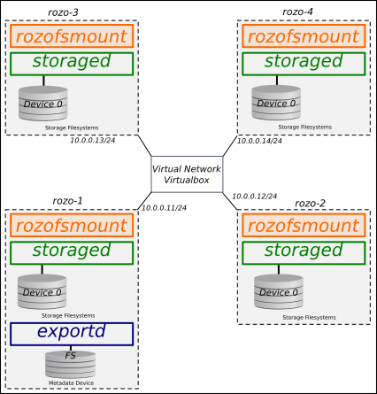

# TP - Stockage distribué

**Mercredi 29 janvier 2020 - Polytech Nantes**

**Intervenant** :

- Sylvain DAVID - *Ingénieur R&D*  - <firstname.lastname@rozosystems.com>

## Introduction

### But du TP

Le but de ce TP est de mettre en œuvre et de comprendre l'architecture d'un système de stockage distribué avec la solution RozoFS. Pour ceux qui ont déjà manipulé RozoFS, il vous est possible d'utiliser un autre système de stockage distribué si vous le souhaitez (**nous le signaler avant si c'est le cas**).	

Dans un premier temps, vous allez mettre en œuvre RozoFS sur une seule machine (en local) pour comprendre le rôle de chaque composant de RozoFS.

Dans un second temps, vous allez installer 4 machines virtuelles via l'utilitaire [*Vagrant*](https://www.vagrantup.com) et tester/explorer les fonctionnalités de RozoFS sur ces 4 machines.

Pour rappel, [RozoFS](https://github.com/rozofs/rozofs) est :

- un système de fichier
- distribué 
- tolérant à la panne
- scalable (horizontalement et verticalement)
- ...

## Comprendre l'architecture de RozoFS

**Avant de passer à l'installation**, répondez succinctement aux questions suivantes en vous aidant de la [documentation en ligne](http://rozofs.github.io/rozofs/develop/AboutRozoFS.html) et du contenu du cours :

- Comment les données sont elles stockées sous RozoFS ? (mode de stockage, répartition)
- Comment et où sont stockées les méta-données des fichiers ? précisez les différents types de métadonnées existants ?

- Quels sont les avantages et les inconvénients d'une solution distribuée telle que RozoFS, par rapport à un système de fichier non-clusterisé ? et par rapport à d'autres systèmes de fichiers clusterisées ?


## Installation de RozoFS sur une seule machine (en local)

Installer les différents packages en suivant la procédure suivante :

Installation du dépôt et de la clé de signature :
```
# wget -O - http://dl.rozofs.org/deb/devel@rozofs.com.gpg.key \
    | apt-key add -
# echo deb http://dl.rozofs.org/deb/develop $(lsb_release -sc) main \
    | tee /etc/apt/sources.list.d/rozofs.list
```

Essayer d'identifier le contenu des paquets suivants, puis les installer :
```
# apt-get update
# apt-get install rozofs-storaged
# apt-get install rozofs-exportd
# apt-get install rozofs-rozofsmount
# apt-get install rozofs-manager-lib
# apt-get install rozofs-manager-cli
# apt-get install rozofs-manager-agent
```

Configurer les différents composants de RozoFS à l'aide de la CLI (*Command Line Interface*) `rozo` et en vous aidant de la page man (`man rozo`).

En vous aidant de la documentation, déterminer la signification des éléments suivants dans RozoFS : `cluster`, `volume`, `export`.

Pour mettre en place un cluster RozoFS, réaliser les étapes suivantes en vous
aidant de la documentation :

- Vérifier que le démon *rozofs-manager-agent* soit bien démarré ;
- Ajouter un volume (`rozo volume expand ...`) ;
- Ajouter d'un export (`rozo export create ...`) ;
- Ajouter d'un client (`rozo mount create ...`).

En vous aidant des pages man de `rozo` et des fichiers de configuration, expliquer succinctement la configuration mise en place.

## Installation de RozoFS sur 4 VMs avec *Vagrant*

Maintenant que vous avez installé et configuré un environnement simple de RozoFS en local, transposer cette configuration sur 4 machines virtuelles *Vagrant* comme indiqué ci-dessous (adressage IP libre) :




**Notes** :

- Essayer de comprendre ce que font les scripts vagrant et consulter la [documentation de *Vagrant*](https://docs.vagrantup.com/v2/) si vous rencontrez des difficultés.
- Consulter les pages man (`storage.conf`, `storaged`) pour avoir plus d'informations sur la configuration d'un serveur de stockage RozoFS.
- Essayer d'utiliser les disques sdb, sdc pour stocker les données de RozoFS (utiliser la commande mkfs.ext4).
- Attention, le paramètre `SID` ne doit pas être identique sur les 4 VMs constituant le cluster.
- Consulter les pages man (`export.conf`, `exportd`) pour avoir plus d'informations sur la configuration d'un serveur de méta-données RozoFS.
- Il est possible d'utiliser l'outil `rozo` (bêta) pour configurer les 4 VMs en une seule commande (`man rozo`).

**Rappel de quelques définitions** :

- *storaged node* : un serveur stockant des projections sur n emplacements logiques de stockage (*storage*) ;
- *storage* : emplacement logique de stockage identifié par un `SID`, un *storage* peut utiliser plusieurs systèmes de fichiers sous-jacents ;
- *device* : un système de fichiers contenant les données des fichiers stockés dans RozoFS ;
- *cluster* : ensemble de *storage* (`host`, `SID`) utilisé pour stocker les données d'un fichier (identifiant : `CID`) ;
- *volume* : un ensemble de *cluster*(s) utilisé(s) pour stocker les données de tous les fichiers d'un même système de fichiers. Un *volume* utilise une configuration de redondance particulière (appelée *layout*) ;
- *layout* : configuration de redondance utilisée pour transformer et stocker les blocs de données.

## Utilisation/test du système de stockage

Après avoir correctement configuré les différents composants de RozoFS,  il est alors possible de tester le comportement du système de fichiers RozoFS. Il vous est demandé pour la suite du TP de **détailler vos réponses** (démarche, explications et copie des commandes). 

- Quel est l'espace disque disponible sur le système de fichiers RozoFS ? Comment est calculé cet espace disponible ?

À l'aide de l'outil `dd`, tester le système de fichiers et répondre aux questions suivantes :

- Où sont localisées les données d'un fichier ?
- Où sont localisées les méta-données d'un fichier ?
- Quel est l'espace disque occupé par un fichier ? Est-ce toujours proportionnel à la taille du fichier ? Pourquoi ? Essayer par exemple de créer un fichier de moins de 4 Ko.
- Créer un petit fichier texte (quelques lignes) sur le système de fichiers RozoFS puis inspecter le contenu d'un des fichiers contenant les projections Mojette (bins) sur un  des *storaged nodes* ? Qu'oberservez vous ?
- Quelles sont les performances en écriture et en lecture séquentielles obtenues sur RozoFS ? Comparer avec un système de fichiers local.

RozoFS étant un système de fichiers tolérant à la panne, essayer de mettre en évidence cette fonctionnalité :

- Supprimer des données (projections) et essayer d'écrire et de lire des fichiers.
- Simuler une panne (réseau, disque, etc) et essayer d'écrire et de lire des fichiers.
- Dans quel cas préférer un système avec du code à effacement à un système à base de réplicas ?
